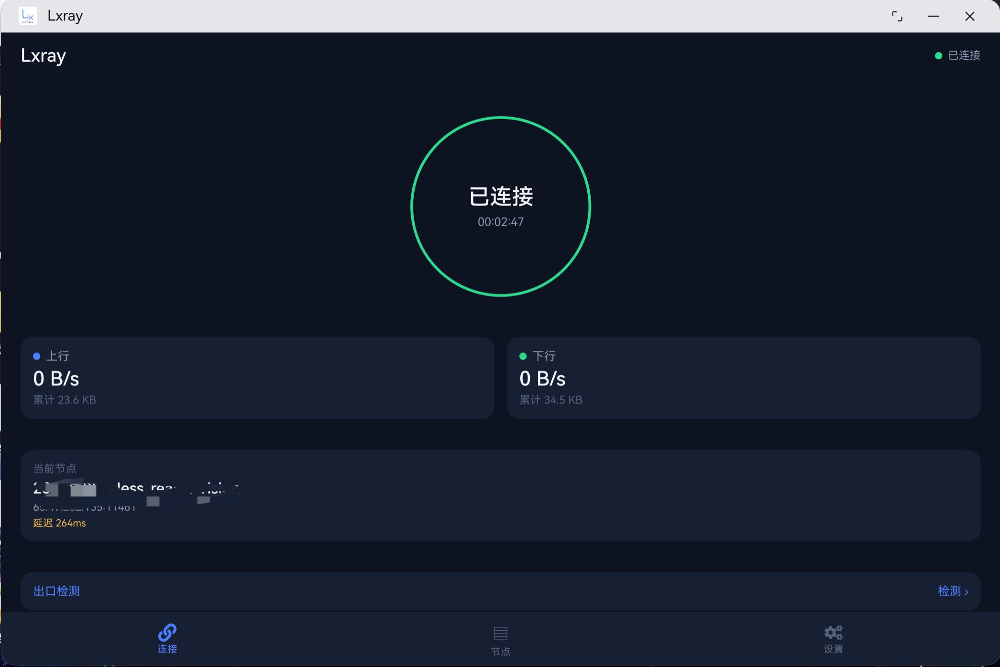
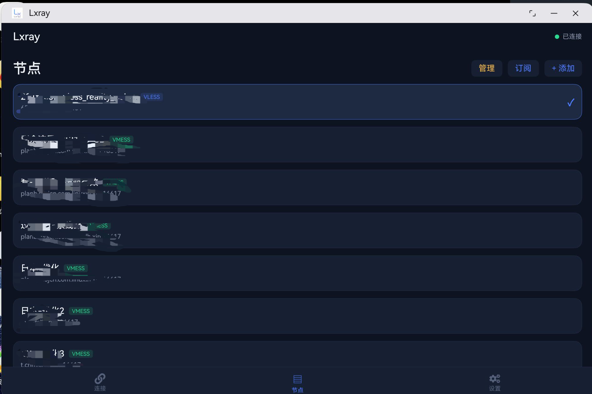
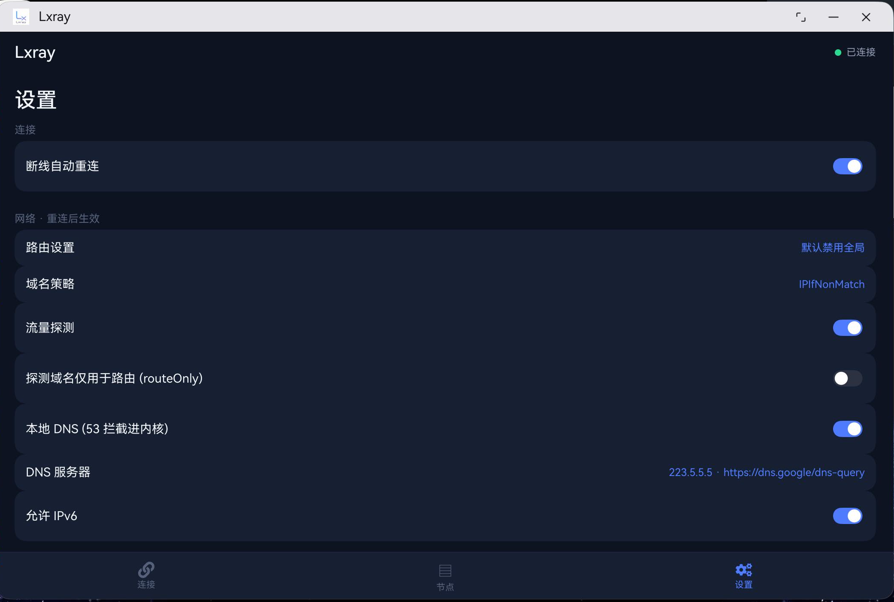

# Lxray - 鸿蒙 VPN 客户端

> 基于 HarmonyOS 的 VPN 客户端应用，核心为 Xray-core（Go 编译为 C 动态库，经 NAPI 桥接），
> 支持 VLESS/VMESS 协议、订阅管理、自定义路由规则、流量统计等。

## 环境配置（重要）

本仓库仅包含源码。**构建环境配置请让 AI 助手读取 [BUILD_RECOVERY.md](BUILD_RECOVERY.md) 完成**，
该文档包含完整的构建流程、鸿蒙专用补丁说明和常见问题处理（可直接粘贴给 AI）。

---

## 界面预览

> 截图已做隐私处理（节点信息打码）

### 1. 主页



- 中央连接环：一键连接/断开 VPN（未连接灰、连接中黄、已连接绿，含在线时长）
- 上下行实时速率与累计流量（数据源为 Xray 内核计数，准确反映实际转发量）
- 当前节点卡片（名称、地址、实时延迟），点击可重新测速
- 出口检测：显示当前节点的真实出口 IP 与地理位置（经代理访问 ip-api 获取）

### 2. 节点管理



- 节点列表：协议标识（VLESS/VMESS）、地址、实时延迟（绿 <200ms / 黄 / 红超时）
- 点击节点即选中；已连接时自动断线重连切换
- 支持添加（粘贴 vless:// / vmess:// 链接）、订阅导入、滑动删除
- 管理模式：批量勾选删除、一键删除重复节点（按地址+端口+协议去重）

### 3. 设置



- 连接：断线自动重连（意外断开后最多重试 3 次，间隔递增）
- 网络：路由模式（默认全局 / 默认禁用全局-国内直连）、域名策略（AsIs / IPIfNonMatch / IPOnDemand）、流量探测（含 QUIC 嗅探）、本地 DNS 拦截、DNS 服务器自定义、IPv6 开关
- 本地代理服务：本机 SOCKS/HTTP 地址、局域网共享（0.0.0.0:10810/10811）、系统代理残留检测
- 订阅：订阅地址管理（添加/更新/删除）、自动更新（每 24 小时，可开关）
- 运行日志：实时刷新、仅错误/警告过滤

---

## 功能特性

| 类别 | 能力 |
|------|------|
| 协议 | VLESS（含 REALITY）、VMESS |
| 订阅 | 多订阅管理、自动更新、去重导入 |
| 路由 | 全局/分流模式、自定义规则（domain/geosite/ip/geoip/port/network/source）、广告拦截 |
| DNS | 本地拦截（53 端口进内核）、国内/国外分流、DoH 防污染 |
| 统计 | Xray 内核计数（按出站聚合）+ 隧道接口速率，每秒广播 |
| 网络 | 本机 SOCKS/HTTP 代理、局域网共享、断线自动重连、出口检测 |
| 调试 | 三层统一日志（ETS/NAPI/GO）、崩溃监听、日志文件按日滚动 |

## 技术架构

```
ArkTS UI（薄 UI 层）
   ↓ NAPI
C++ 桥接层（libentry.so：worker 线程 + 串行化 + dlopen）
   ↓
Go 核心（libcore.so：xray-core 26.3.27 编译为 C 动态库）
   ├─ CoreService   xray 生命周期/统计
   ├─ NodeService   节点延迟
   ├─ TestService   出口检测
   └─ SubscriptionService  订阅代理拉取
```

- 网络层：tun 模式经 gvisor 协议栈，fd 由系统 VPN 框架授予
- 独立进程：VPN 核心运行在 `:vpn` 扩展进程，UI 进程死亡不影响隧道
- 关键适配：鸿蒙 musl TLS 限制（worker 线程进入 Go）、tun fd fstat 权限（自研直写端点）、系统代理只读（检测残留）

## 平台限制（已知）

- IPv6 流量走真实网络（鸿蒙 VPN 框架 v6 支持不成熟，v4 全代理）
- 关窗保活不可用（长时任务被系统校验拒绝）
- 无法自动设置/清除系统代理（无三方 API）
- 无法枚举已安装应用（受限权限）

## 版本

- 框架版本：1.0.0
- 核心版本：Xray 26.3.27
